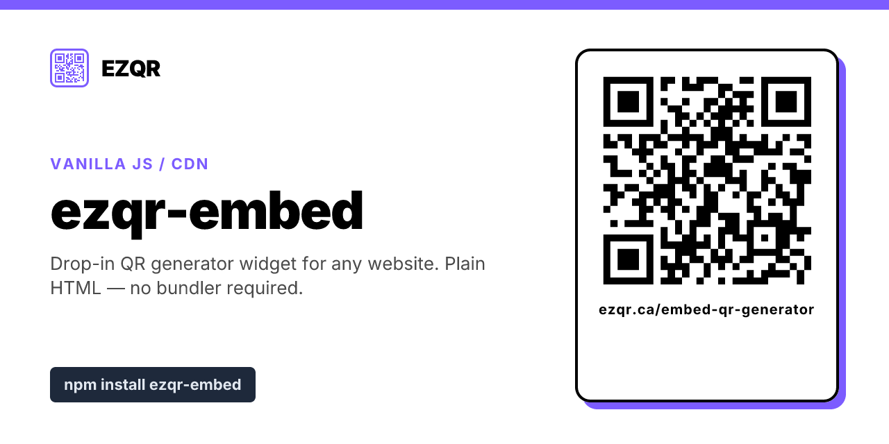

# ezqr-embed



Drop-in embeddable QR code generator widget for any website. Works without a bundler.

Powered by [EZQR - Free QR Code Generator](https://ezqr.ca).

## Try it live

See the embed running on a few popular code-sandbox sites:

- [CodePen demo](https://codepen.io/albinodrought/pen/019e2964-dc28-7fcf-bb15-bd2d48b1125a)
- [JSFiddle demo](https://jsfiddle.net/fdxm47yw/2/)
- [JSitor demo](https://jsitor.com/27yNMcwUE8)

## Quick start (no bundler)

Paste this anywhere in your HTML:

```html
<div data-ezqr-embed style="max-width:500px;margin:0 auto"></div>
<p style="font-size:12px;text-align:center;margin:8px 0;color:#5d6d7e;font-family:sans-serif">
  <a href="https://ezqr.ca" target="_blank" rel="noopener" style="color:#1a6b3b;text-decoration:none">Free QR code generator</a> by EZQR
</p>
<script src="https://unpkg.com/ezqr-embed" async></script>
```

That's it - the script finds every `[data-ezqr-embed]` placeholder and turns
it into a working QR code generator. Visitors paste a link, press the button,
and download as PNG, SVG, or JPG.

Prefer jsDelivr? Use `https://cdn.jsdelivr.net/npm/ezqr-embed` instead.

## Quick start (with a bundler)

```bash
npm install ezqr-embed
```

```js
import 'ezqr-embed'; // auto-mounts every [data-ezqr-embed] on the page
```

Or render programmatically:

```js
import { render } from 'ezqr-embed';

render('#my-container');
render(document.getElementById('my-container'), { height: 640 });
```

## Customization

### Height

Default is 520px. Override per-embed:

```html
<div data-ezqr-embed data-ezqr-height="640"></div>
```

Or programmatically:

```js
EZQR.render('#my-container', { height: 640 });
```

### Width

Always 100% of the container - set the container's `max-width` to control
overall width:

```html
<div data-ezqr-embed style="max-width:640px"></div>
```

### Multiple embeds on one page

Each `[data-ezqr-embed]` placeholder mounts independently. You can have as
many as you want.

## Attribution

The snippet ships with a small "Free QR code generator by EZQR" caption under
the embed. **Keeping it is appreciated** - it's how we sustain offering the
embed for free.

If you remove the caption from the HTML, the script will re-add a minimal
version next to the placeholder. (Same pattern as Twitter, Instagram, and
YouTube embeds.)

## License

MIT

## Links

- [EZQR - Free QR Code Generator](https://ezqr.ca)
- [Embed landing page](https://ezqr.ca/embed-qr-generator)
- [Custom QR codes](https://ezqr.ca/custom-qr-code) (logo, color, shape)
- [Dynamic QR codes](https://ezqr.ca/editable-qr-codes) (editable, tracked)
